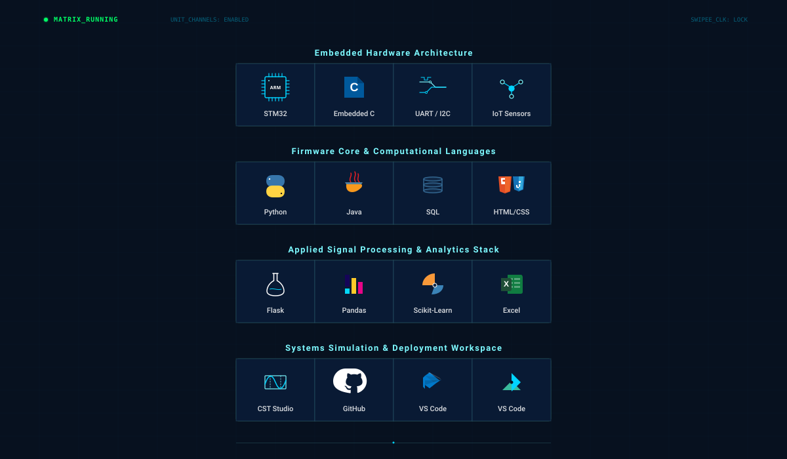

  

<h2 align="center">
Engineering Systems • Embedded Intelligence • Applied Research
</h2>

<table style="display: inline-table; border: 1px solid #00C3E3; border-collapse: collapse; background-color: #060C14; font-family: monospace;">
  <tr>
    <td style="padding: 8px 16px; border: 1px solid #00C3E3; color: #7DF9FF;">📍 <b>Gurugram, India</b></td>
    <td style="padding: 8px 16px; border: 1px solid #00C3E3; color: #FFFFFF;"><a href="mailto:kushs0985@gmail.com" style="color: #FFFFFF; text-decoration: none;">✉️ kushs0985@gmail.com</a></td>
    <td style="padding: 8px 16px; border: 1px solid #00C3E3; color: #FFFFFF;"><a href="https://github.com/Kush99-ux" style="color: #FFFFFF; text-decoration: none;">💻 github.com/Kush99-ux</a></td>
    <td style="padding: 8px 16px; border: 1px solid #00C3E3; color: #FFFFFF;"><a href="https://www.linkedin.com/in/kush-sahu-450405229/" style="color: #FFFFFF; text-decoration: none;">🤝 LinkedIn Profile</a></td>
  </tr>
</table>

---

## Engineering Identity

Electrical & Computer Engineering student at Shiv Nadar University focused on embedded systems, intelligent sensing, signal processing, and IoT systems infrastructure.

Current work combines low-level embedded firmware development, real-time sensor data acquisition, hardware-level communication protocols, and simulation-driven microwave/RF engineering.

---

## Technical Toolchain Matrix

  

---

## Featured Engineering Projects

<table style="width: 100%; border-collapse: collapse; border: none; font-family: -apple-system, BlinkMacSystemFont, sans-serif;">
  <tr>
    <td width="50%" valign="top" style="border: none; padding: 0 8px 16px 0;">
      

        

          🚲 Smart Bicycle Lock
          SYS_ACTIVE
        

        

          
          
          
          
        

        

          Bluetooth-authenticated hardware prototype executing bare-metal tracking and encryption loops. Designed low-level peripheral driver firmware layer mapping sensor configurations to hardware components.
        

        <ul style="font-size: 12px; color: #FFFFFF; opacity: 0.75; padding-left: 18px; margin: 0 0 16px 0; line-height: 1.5;">
          <li>Sensor-fusion array capturing real-time coordinate data and axis vectors.</li>
          <li>Structured communication over bus lines to drive locking mechanisms.</li>
        </ul>
        <a href="https://github.com/Kush99-ux/smart-bicycle-lock-stm32" style="display: inline-block; background-color: #060C14; border: 1px solid #00C3E3; color: #7DF9FF; padding: 6px 12px; font-family: monospace; font-size: 11px; font-weight: bold; text-decoration: none; border-radius: 4px;">🔬 INITIALIZE_REPO →</a>
      

    </td>
    <td width="50%" valign="top" style="border: none; padding: 0 0 16px 8px;">
      

        

          📡 Wilkinson Power Divider
          RF_SIM_LOCK
        

        

          
          
          
        

        

          High-frequency planar microstrip simulation built over Rogers substrates within the ISM radio band. Engineered quarter-wave transformer geometric vectors to equalize power balance lines.
        

        <ul style="font-size: 12px; color: #FFFFFF; opacity: 0.75; padding-left: 18px; margin: 0 0 16px 0; line-height: 1.5;">
          <li>Locked insertion performance boundaries to an optimal ~-3.1 dB.</li>
          <li>Verified high-isolation parameters keeping port metrics matching -24 dB.</li>
        </ul>
        <a href="https://github.com/Kush99-ux/Wilkinson-Power-Divider-CST" style="display: inline-block; background-color: #060C14; border: 1px solid #00C3E3; color: #7DF9FF; padding: 6px 12px; font-family: monospace; font-size: 11px; font-weight: bold; text-decoration: none; border-radius: 4px;">📊 ANALYZE_WAVEFORM →</a>
      

    </td>
  </tr>
  <tr>
    <td colspan="2" valign="top" style="border: none; padding: 0;">
      

        

          🧠 AI Job Automation Predictor
          COMPUTE_DECK_03
        

        

          
          
          
          
        

        

          Predictive data processing architecture mapping structural skill features to probability metrics, achieving an validation R² score of 0.867. Implemented clean modular preprocessing routines to manage high-cardinality vectors across diverse occupation domains.
        

        <a href="https://ai-impact-on-jobs.onrender.com/" style="display: inline-block; background-color: #060C14; border: 1px solid #00C3E3; color: #7DF9FF; padding: 6px 12px; font-family: monospace; font-size: 11px; font-weight: bold; text-decoration: none; border-radius: 4px;">🖥️ EXECUTE_MODEL →</a>
      

    </td>
  </tr>
</table>

---

## Technical Domains Overview

| Structural Core | Focus Domain Implementation |
| :--- | :--- |
| **Embedded Systems** | Bare-metal MCU Firmware, Peripherals &amp; Driver Layer Architecture |
| **Intelligent Sensing** | Multi-Protocol Bus Sensor Integration (I2C, SPI, UART) |
| **Signal Processing** | Waveform Data Isolation, High-Pass/Low-Pass Filtration, Spectral Maps |
| **RF Engineering** | High-Frequency Microwave Modeling, Component Routing &amp; S-Parameters |
| **Edge Computing** | Constrained Logic Computing, Memory Optimizations &amp; Concurrency |

---

## Leadership &amp; Corporate Collaboration

### Associate Secretary II — IEEE Student Branch, SNU
*Feb 2025 – Feb 2026*
* Coordinated systemic multi-part specialized laboratory sessions ('Circuit Breakers') focusing on structural analog and digital circuit configurations, keeping student retention boundaries over 30%.

### Student Ambassador — Career Development Centre (CDC), SNU
*Mar 2026 – Present*
* Deployed optimized engagement strategies for external organizational integration, processing structural cohort profiles to verify data metrics across channels.

### VVDN Technologies
*Corporate Engineering Profile Associate Track*

---

## GitHub Analytics

  
  

  

---

