<p align="center">
  
</p>

<h2 align="center">
Engineering Systems • Embedded Intelligence • Applied Research
</h2>

<div align="center">
<table style="border: 1px solid #00C3E3; border-collapse: collapse; background-color: #060C14; font-family: monospace;">
  <tr>
    <td style="padding: 8px 16px; border: 1px solid #00C3E3; color: #7DF9FF;">📍 <b>Gurugram, India</b></td>
    <td style="padding: 8px 16px; border: 1px solid #00C3E3; color: #FFFFFF;"><a href="mailto:kushs0985@gmail.com" style="color: #FFFFFF; text-decoration: none;">✉️ kushs0985@gmail.com</a></td>
    <td style="padding: 8px 16px; border: 1px solid #00C3E3; color: #FFFFFF;"><a href="https://github.com/Kush99-ux" style="color: #FFFFFF; text-decoration: none;">💻 github.com/Kush99-ux</a></td>
    <td style="padding: 8px 16px; border: 1px solid #00C3E3; color: #FFFFFF;"><a href="YOUR_LINKEDIN_URL" style="color: #FFFFFF; text-decoration: none;">🤝 LinkedIn Profile</a></td>
  </tr>
</table>
</div>

---

## Engineering Identity

Electrical & Computer Engineering student at Shiv Nadar University focused on embedded systems, intelligent sensing, signal processing, and IoT systems infrastructure.

Current work combines low-level embedded firmware development, real-time sensor data acquisition, hardware-level communication protocols, and simulation-driven microwave/RF engineering.

---

## Live System Telemetry Pipeline
<div align="center">
<svg xmlns="http://www.w3.org/2000/svg" viewBox="0 0 800 60" width="100%" height="60">
  <rect width="800" height="60" fill="#060C14" rx="4" stroke="#00C3E3" stroke-width="0.5"/>
  <g font-family="ui-monospace, monospace" font-size="10" fill="#00C3E3" font-weight="bold">
    <text x="40" y="35">[SENSORS]</text>
    <text x="210" y="35">[FIRMWARE]</text>
    <text x="390" y="35">[DSP MODULE]</text>
    <text x="570" y="35">[IoT STACK]</text>
    <text x="710" y="35">[VALIDATE]</text>
  </g>
  <g stroke="#7DF9FF" stroke-width="1.5" fill="none" stroke-linecap="round">
    <path d="M 110 32 L 190 32" stroke-dasharray="6,6"><animate attributeName="stroke-dashoffset" values="20;0" dur="2s" repeatCount="indefinite"/></path>
    <path d="M 290 32 L 370 32" stroke-dasharray="6,6"><animate attributeName="stroke-dashoffset" values="20;0" dur="2s" repeatCount="indefinite"/></path>
    <path d="M 480 32 L 550 32" stroke-dasharray="6,6"><animate attributeName="stroke-dashoffset" values="20;0" dur="2s" repeatCount="indefinite"/></path>
    <path d="M 650 32 L 690 32" stroke-dasharray="6,6"><animate attributeName="stroke-dashoffset" values="20;0" dur="2s" repeatCount="indefinite"/></path>
  </g>
  <circle cx="25" cy="31" r="2" fill="#7DF9FF"><animate attributeName="opacity" values="0.2;1;0.2" dur="1s" repeatCount="indefinite"/></circle>
  <circle cx="195" cy="31" r="2" fill="#7DF9FF"><animate attributeName="opacity" values="1;0.2;1" dur="1.4s" repeatCount="indefinite"/></circle>
  <circle cx="375" cy="31" r="2" fill="#7DF9FF"><animate attributeName="opacity" values="0.2;1;0.2" dur="0.8s" repeatCount="indefinite"/></circle>
</svg>
</div>

---

## Technical Toolchain Matrix

### Embedded Systems
<div align="center">
  <table style="border-collapse: collapse; border: none; margin: 10px 0;">
    <tr>
      <td style="border: none; padding: 6px;"><a href="#"></a></td>
      <td style="border: none; padding: 6px;"><a href="#"></a></td>
      <td style="border: none; padding: 6px;"><a href="#"></a></td>
      <td style="border: none; padding: 6px;"><a href="#"></a></td>
      <td style="border: none; padding: 6px;"><a href="#"></a></td>
      <td style="border: none; padding: 6px;"><a href="#"></a></td>
      <td style="border: none; padding: 6px;"><a href="#"></a></td>
    </tr>
  </table>
</div>

### Programming
<div align="center">
  <table style="border-collapse: collapse; border: none; margin: 10px 0;">
    <tr>
      <td style="border: none; padding: 6px;"><a href="#"></a></td>
      <td style="border: none; padding: 6px;"><a href="#"></a></td>
      <td style="border: none; padding: 6px;"><a href="#"></a></td>
      <td style="border: none; padding: 6px;"><a href="#"></a></td>
    </tr>
  </table>
</div>

### IoT & Data
<div align="center">
  <table style="border-collapse: collapse; border: none; margin: 10px 0;">
    <tr>
      <td style="border: none; padding: 6px;"><a href="#"></a></td>
      <td style="border: none; padding: 6px;"><a href="#"></a></td>
      <td style="border: none; padding: 6px;"><a href="#"></a></td>
      <td style="border: none; padding: 6px;"><a href="#"></a></td>
    </tr>
  </table>
</div>

### Engineering Tools
<div align="center">
  <table style="border-collapse: collapse; border: none; margin: 10px 0;">
    <tr>
      <td style="border: none; padding: 6px;"><a href="#"></a></td>
      <td style="border: none; padding: 6px;"><a href="#"></a></td>
      <td style="border: none; padding: 6px;"><a href="#"></a></td>
      <td style="border: none; padding: 6px;"><a href="#"></a></td>
      <td style="border: none; padding: 6px;"><a href="#"></a></td>
    </tr>
  </table>
</div>

### Analytics & Finance
<div align="center">
  <table style="border-collapse: collapse; border: none; margin: 10px 0;">
    <tr>
      <td style="border: none; padding: 6px;"><a href="#"></a></td>
      <td style="border: none; padding: 6px;"><a href="#"></a></td>
    </tr>
  </table>
</div>

---

## Featured Engineering Projects

### Smart Bicycle Lock
**STM32F303RE • Embedded C • Bluetooth LE • GPS Telematics • IoT Sensors**
* Developed a Bluetooth-authenticated smart bicycle lock hardware prototype utilizing the STM32F303RE Nucleo architecture.
* Enhanced active theft prevention mechanics by implementing sensor-fusion interfaces with GPS modules and MPU6050 accelerometers for real-time location tracking and vibration tamper sensing.
* Developed low-level firmware utilizing the STM32 HAL framework over UART/I2C protocols to handle execution state logic and precise servo-actuated physical locking parameters.

---

### Wilkinson Power Divider Simulation
**CST Studio Suite • RF & Microwave Engineering • EM Layout Optimization**
* Designed and configured an isolated Wilkinson Power Divider operating in the 2.4 GHz ISM band using industrial 3D electromagnetic validation code in CST Studio Suite.
* Modeled planar microstrip layouts over high-frequency low-loss Rogers RO3C substrates, scaling parameters to lock an insertion loss near the theoretical ~−3.1 dB threshold and return loss parameters to below −23 dB.
* Verified performance metrics via multi-port S-parameter sweeps, tracking optimal impedance transformations alongside cross-port isolation barriers matching −24 dB.

---

### AI Job Impact Predictor
**Python • Scikit-Learn • Flask • Structural Modeling**
* Designed and evaluated a predictive machine learning modeling application optimizing data processing structures to calculate workforce automation vectors, locking down an validation R² score of 0.867.
* Maintained custom mapping transformations to translate high-cardinality complex skill structures reliably across discrete engineering profiles.

---

### Bank Management System
**Java • Swing GUI • Relational Databases • Modular OOP**
* Deployed a modular desktop application handling standard consumer account validation states, relational schema updates, and execution processing protocols.

---

## Technical Domains Overview

| Structural Core | Focus Domain Implementation |
| :--- | :--- |
| **Embedded Systems** | Bare-metal MCU Firmware, Peripherals &amp; Driver Layer Architecture |
| **Intelligent Sensing** | Multi-Protocol Bus Sensor Integration (I2C, SPI, UART) |
| **Signal Processing** | Waveform Data Isolation, High-Pass/Low-Pass Filtration, Spectral Maps |
| **RF Engineering** | High-Frequency Microwave Modeling, Component Routing &amp; S-Parameters |
| **Edge Computing** | Constrained Logic Computing, Memory Optimizations &amp; Concurrency |

---

## Leadership &amp; Corporate Collaboration

### Associate Secretary II — IEEE Student Branch, SNU
*Feb 2025 – Feb 2026*
* Coordinated systemic multi-part specialized laboratory sessions ('Circuit Breakers') focusing on structural analog and digital circuit configurations, keeping student retention boundaries over 30%.

### Student Ambassador — Career Development Centre (CDC), SNU
*Mar 2026 – Present*
* Deployed optimized engagement strategies for external organizational integration, processing structural cohort profiles to verify data metrics across channels.

### VVDN Technologies
*Corporate Engineering Profile Associate Track*

---

## GitHub Analytics

<p align="center">
  
  
</p>

<p align="center">
  
</p>

---

## Long-Term Academic &amp; Research Vector

```text
  [Embedded Systems & Low-Power Firmware]
                     ↓
        [Applied Signal Processing]
                     ↓
         [RF Component Design]
                     ↓
  [Advanced Industrial Systems Research]
                     ↓
    [Graduate Studies Pathway (Germany)]